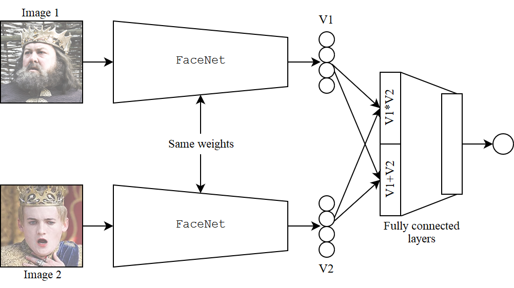
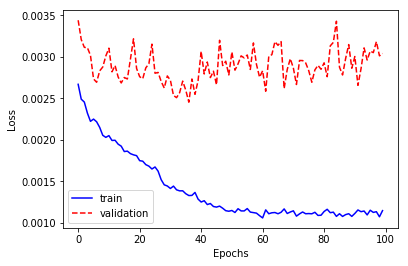
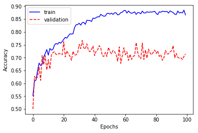

# Kin verification with siamese neural network

## Requrements

* `Python >= 3.6`
* `PyTorch >= 1.0`

## Get started
1. Download [Families in the Wild](https://www.kaggle.com/c/recognizing-faces-in-the-wild/data) dataset. Unzip and organize like this:

```
data
├── train
│   └── ...
├── test
│   └── ...
└── train_relationships.csv
```

2. Clone pretrained implementation of FaceNet for PyTorch: `git clone https://github.com/timesler/facenet-pytorch.git facenet_pytorch`

3. Run `train.py`.

## Network architecture
A Siamese network with FaceNet encoder is used:



## Results


